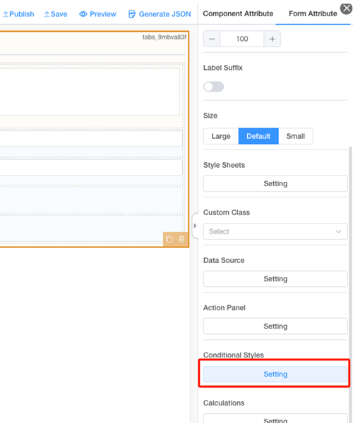
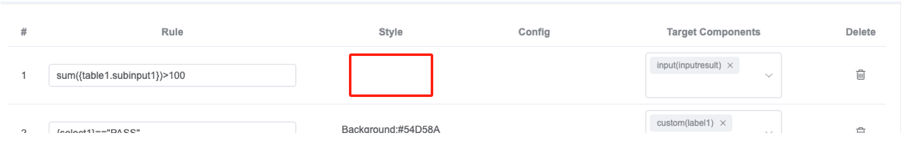
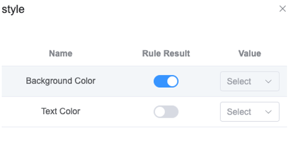
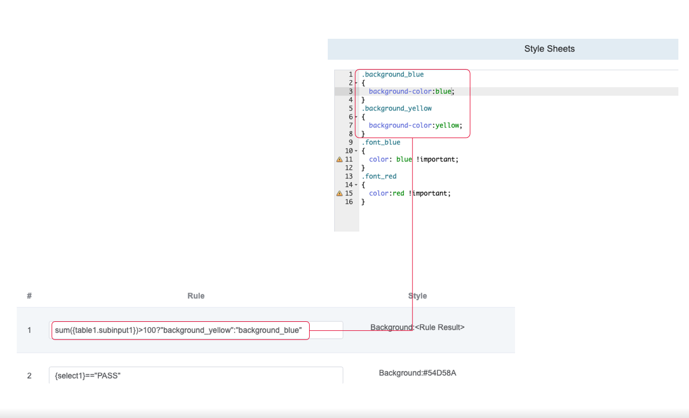
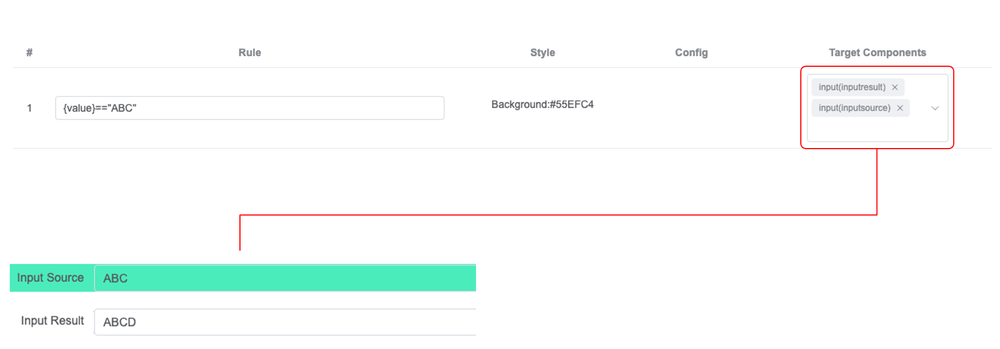

# Conditional Style

## What is Conditional Style for the template?

Conditions Style is a kind of backend logic which can be configured in template design-time, this logic can ben saved together with template design and rendered in run-time, aim to ***control the display style or component behavior for specific fields*** based on the pre-defined calculation logic regard to other fields value which were filled in real-time.

## How to define Conditional Style for the template?

### Open form conditional style

**Form Attribute** Panel->Conditional Styles **Settings**

### Config Conditional styles

【1】On **Field structure Tree**, click target object

   Using field structure tree, you can

* 1st level collapse by default.
* Support search by node.
* Quick copy the ID of the node by clicking the small icon.
* Support  click & drag to adjust the width of the structure tree display area.

【2】Click **Add Rule** button

【3】On area of operation

   Dragging or move rules

* Can adjust the width by dragging the border of the header.
* Can move up/down by click and drag the item of the indicator.

【4】Validation

    click to verify whether there’s any component id mis-typing or deleted.

【5】Save

    Click to save the conditional style definition to the template.

## Edit Conditional styles

### Method1: Using style value feature

【1】Double click  style  of the rule item

【2】Select vaule of  target style item

:::info
Click to pop-out the config window to set the style, can either choose by "Rule Result"  or  "Value"

1. If choose by "Rule Result",  the Rule calculation result should be a valid result which meet the result (you cannot apply a True/False to the style)
2. If choose by "Value", the Rule calculation result should be a Boolean result, once the result is TRUE, then this style will be apply to the target component, we've provided many default colors for quick selection.

:::

【3】review sytle value, or adjust rule.

### Method2: Using rule result feature

【1】Double click  style  of the rule item

【2】Turn on the rule result of  target style item

【3】Review sytle value, or adjust rule.

:::info
Since this scenario is controlled by `<Rule Result>`, the Rule configured should return a valid result which can be used to apply to the policy, when it is related to style, eReporting does not support directly input color number such as #FEDADF, it should be a valid CSS Class defined in Style Sheets, in this case, "background_yellow" and "background_blue" is a pre-defined CSS class

:::

## UI Preview

### View Sample

There's a reserved keyword {value} which can be used for batch conditional style configuration.

## Conditional Style List

### Supported List

Here’re the Conditional Style List currently supported for the eReporting Report Designer

| **Type** | **Control Point** | **Description**                                                                                                                                                                              | **Component Scope** |
| -------------- | ----------------------- | -------------------------------------------------------------------------------------------------------------------------------------------------------------------------------------------------- | :-----------------------: |
| Style          | Background Color        | Control the Background Color for the component(s), if by `<Rule Result>`, it should return a valid pre-defined CSS Class Name, or can directly select a static color in case Rule result is TRUE |            All            |
|                | Text Color              | Control the Text Color for the component(s), if by `<Rule Result>`, it should return a valid pre-defined CSS Class Name, or can directly select a static color in case Rule result is TRUE       |            All            |
| Config         | Hidden                  | Hide the component(s) if the Rule Result is TRUE, if by `<Rule Result>`, it would Hide/Display the Component(s) by the Rule calculation result                                                   |            All            |
|                | Read-Only               | Set the component(s) as Read-Only if the Rule Result is TRUE, if by `<Rule Result>`, it would Enable/Disable Read-Only to Component(s) by the Rule calculation result                            |            All            |
|                | Allow Empty             | Control if the component(s) is allow empty if the Rule Result is TRUE, if by `<Rule Result>`, it would Enable/Disable empty validation to Component(s) by the Rule calculation result            |            All            |
|                | Placeholder Text        | Control the Placeholder Text for component(s) if the Rule Result is TRUE, if by `<Rule Result>`, it would use the rule result as placeholder text to Component(s)                                |            All            |
|                | Min Value               | Control the Min Value for component(s) if the Rule Result is TRUE, if by `<Rule Result>`, it would use the rule result as Min Value to Component(s)                                              |          Number          |
|                | Max Value               | Control the Max Value for component(s) if the Rule Result is TRUE, if by `<Rule Result>`, it would use the rule result as Max Value to Component(s)                                              |          Number          |

### Key Points for Conditional Style

* The Rule function name and field ID which used inside condition rule is case sensitive.
* You can only config one type for one rule item, either "Style" or "Config"
* You can only config either by `<Rule Result>` or Directly input static content for Style or Config.
* Some of the rule has parameter with value from the component, data type restriction should be considered, might not return value or cause form rendering error if passing the wrong types of data to the formula.
* Please be aware of the multiple rule items configured to avoid logic conflict.
