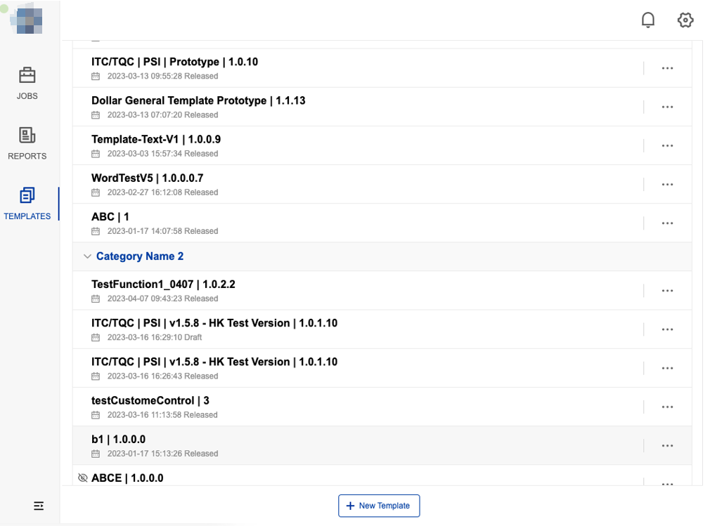
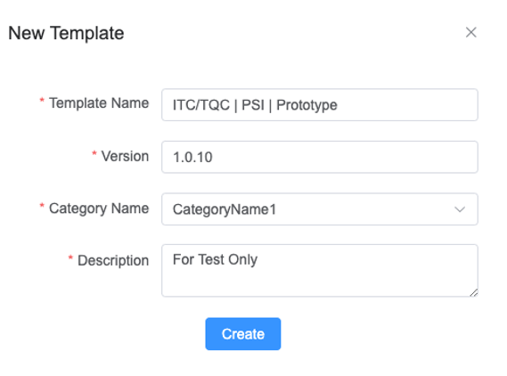
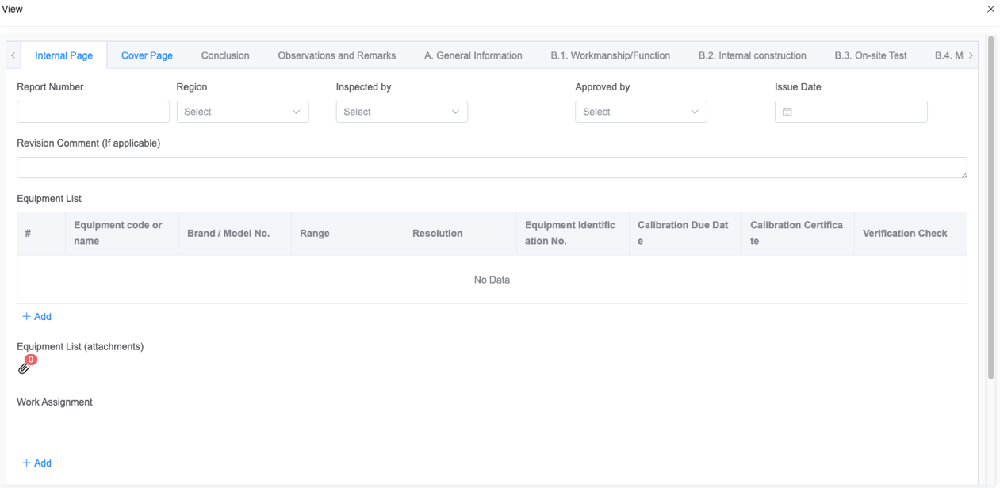

# Template Center

Show all templates and manage template.

## Features

- [X] Display Report Template List (draft & released)
- [X] Delete
- [X] Enable/Disable
- [X] Version History
- [X] Copy and Create
- [X] Data Mapping
- [X] Authorization
- [X] Divider Maintenance

## Create a new template

1.Click  "**New Template**" button.

2.Fill in tempate infomation.

3.Desinge template and save/publish.

## Tempate history

1.Click "..." button on target tempate, and click  "Version History".

2.Click "ENE" link on target version.

3.Show the history template designe model.

