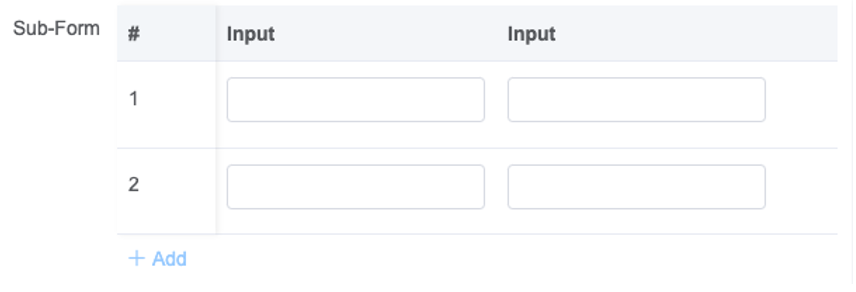

# Sub form

Used to display list array fields, can be added/deleted to the array.

## Features

- [X] Basic Usage
- [X] Line number
- [X] Data Souce

### Basic Usage

Basic function : add list fields, support paging and customize style.

### Line number

Config if need to display the line number and action icon for each line.

### Data Souce

Can set the default value for the sub-form list when the report form is initially loaded.

:::info

1.This need to input the default data as JSON format.
2.The input JSON should strictly follow the field definition

:::

## UI Preview

### Design Time

### Run Time

## Key Attribute for component

| Attribute Name     | Attribute Description                                                                                                                                                                                                                                                                                                                                                                                                                                                                           | Additional Info                                                                                                                                                                          |
| :----------------- | :---------------------------------------------------------------------------------------------------------------------------------------------------------------------------------------------------------------------------------------------------------------------------------------------------------------------------------------------------------------------------------------------------------------------------------------------------------------------------------------------- | :--------------------------------------------------------------------------------------------------------------------------------------------------------------------------------------- |
| Source Key         | Component ID for the data source                                                                                                                                                                                                                                                                                                                                                                                                                                                                | Can only be a repeating container component ID,``once configured, that means the current sub-form cannot add/delete row, ``it will consistency follow the source component |
| Paging             | Set if support add paging to the repeating table                                                                                                                                                                                                                                                                                                                                                                                                                                                |                                                                                                                                                                                          |
| Page Size          | Set the page size for the list                                                                                                                                                                                                                                                                                                                                                                                                                                                                  | This attribute only appears when the paging is enabled                                                                                                                                   |
| Show Control       | Config if need to display the line number and action icon for each line                                                                                                                                                                                                                                                                                                                                                                                                                         |                                                                                                                                                                                          |
| Virtual Table      | Config the display mode for the sub-form                                                                                                                                                                                                                                                                                                                                                                                                                                                        | If Virtual Table is disabled, the sub-form will display in a flat layout                                                                                                                 |
| Default Value      | Can set the default value for the sub-form list when the report form is initially loaded.``This need to input the default data as JSON format.``The input JSON should strictly follow the field definition                                                                                                                                                                                                                                                                        |                                                                                                                                                                                          |
| Prefix             | Prefix to the index, before number                                                                                                                                                                                                                                                                                                                                                                                                                                                              |                                                                                                                                                                                          |
| Suffix             | Suffix to the index, after number                                                                                                                                                                                                                                                                                                                                                                                                                                                               |                                                                                                                                                                                          |
| Index Width        | Control the index width to be shown on the page``in case the prefix/suffix make the index don't have enough space to show the combined index                                                                                                                                                                                                                                                                                                                                             |                                                                                                                                                                                          |
| Group By           | Select 1 or 2 field to make group,``this is for controlling the table display when generate the output report                                                                                                                                                                                                                                                                                                                                                                            |                                                                                                                                                                                          |
| Output Table Style | Controlling the table column display when generate the output report``[{"width":400,"align":""},{"width":6000,"align":"left"},``{"width":0,"align":""},{"width":0,"align":""},{"width":0,"align":""}]``If make width 0, it will auto-fit, if make width 1, the field will not show in the final output, ``if make align blank, it means default (center align), ``the configuration should be exactly same number as sub form fields (including index field) |                                                                                                                                                                                          |
