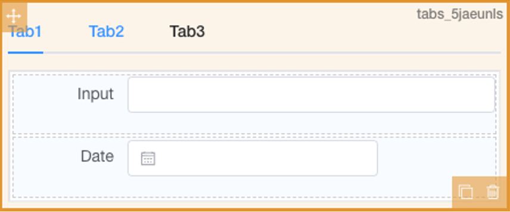

# Tab

## Features

- [X] Basic Usage

### Basic Usage

Basic function : add or delete tabs.

## UI Preview

### Design Time

### Run Time

## Key Attribute for component

| Attribute Name | Attribute Description                   | Additional Info                                                                                                                  |
| :------------- | :-------------------------------------- | :------------------------------------------------------------------------------------------------------------------------------- |
| Source Key     | Component ID for the data source        | N/A for this component                                                                                                           |
| Type           | Select the display style for the Tabs   |                                                                                                                                  |
| Tab Position   | Set the position for displaying the tab |                                                                                                                                  |
| Tab Options    | Choose to add tab options here          | Please be careful when try to remove the option from the list,  as this will also remove all the components within the tab option |
