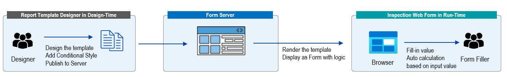
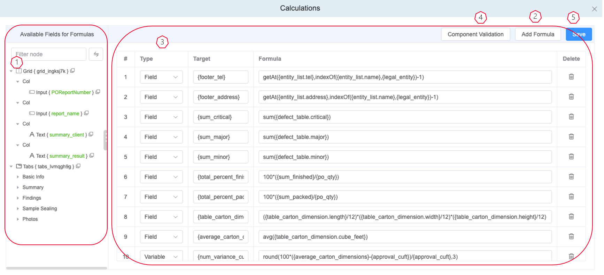

# Calculation

## What is Calculation for the template?

Calculation is a kind of backend logic which can be configured in template design-time, this logic can ben saved together with template design and rendered in run-time, aim to ***set the value to specific fields*** based on the pre-defined calculation logic regard to other fields value which were filled in real-time.

## How to define Calculation for the template?

eReporting Designer support add centralize maintained Calculation logic into the template.

### Open form Calculation

**Form Attribute** Panel->Calculations **Settings**

### Config Calculation

【1】On **Field structure Tree**, click target object

   Using field structure tree, you can

* 1st level collapse by default.
* Support search by node.
* Quick copy the ID of the node by clicking the small icon.
* Support  click & drag to adjust the width of the structure tree display area.

【2】Click **Add formula**  button

【3】On area of operation

   Dragging or move rules

* Can adjust the width by dragging the border of the header.
* Can move up/down by click and drag the item of the indicator.

:::info
Calculation formula can be defined here

* Type: Define the result is a Field or a Variable, variable can be reused in other formulas as parameter.
* Target: Refers to where the result of the calculation should be displayed and you can only enter one target.
* Formula: Define the logic of calculation, can support common operator or formula

:::

【4】Validation

   Click to verify whether there’s any component id mis-typing or deleted.

【5】Save

   Click to save the calculation definition to the template.

## Formula List

Here're the Formula List currently supported for the eReporting Report Designer
| Formula | Description | Example |
| --- | --- | --- |
| isNumber(value)              | Check if the value is a number. Returns true or null.                               | isNumber({input_6xcbr9sz}) Check if the component with ID: input_6xcbr9szis a number or not                                                  |
| toNumber(value)              | Convert the value to a number. Returns a number.                                    | toNumber({input_6xcbr9sz}) Convert the value of component with ID:`input_6xcbr9szto a number           |
| count(array, value)          | Count the number of items in an array. Optionally,  count the number of a specific value in an array. Returns a number.                                                                                             | count({table_p4ek2ugx.input_6xcbr9sz},1) Count the number of items which value equals to1for the fieldinput_6xcbr9szin the list: table_p4ek2ugx                                                      |
| indexOf(array, value)        | Gets the first index at which a given value can be found in an array. Returns a number.                                                                                                                            | indexOf({table_p4ek2ugx.input_6xcbr9sz},1) Get the first index at which value 1 can be found in the field input_6xcbr9szof repeating table:table_p4ek2ugx                                                              |
| like(value, match)           | Checks if a text value includes a match value. Returns true or null.                | like ({input_6xcbr9sz}, ‘123’) Check if value of the component with IDinput_6xcbr9szincludes value123                                              |
| substr(value, start, length) | Returns a portion of text value, starting at the specified start index  and extending for a given length of characters afterwards. Returns a new text.                                                              | substr ({input_6xcbr9sz},1,4) Returns a portion of text value from component with IDinput_6xcbr9sz, starting at the specified start index 1and extending for a given length of4characters afterwards. |
| sum(array)                   | Calculates the addition all the numbers in an array. Returns a number.              | sum({table_p4ek2ugx.input_6xcbr9sz}) Calculates the addition all the field with ID input_6xcbr9szin the array table_p4ek2ugx.                                                                                           |
| avg(array)                   | Calculates the average all the numbers in an array. Returns a number.               | avg ({table_p4ek2ugx.input_6xcbr9sz}) Calculates the average all the field with ID input_6xcbr9szin the array table_p4ek2ugx.                                                                                           |
| avg(array)                   | Calculates the average all the numbers in an array. Returns a number.               | avg ({table_p4ek2ugx.input_6xcbr9sz}) Calculate the average value for the fieldinput_6xcbr9szin the listtable_p4ek2ugx, or can compose the input parameter to treat like array [{field1},{field2},{field3}…]                                                                      |
| min(array)                   | Finds the lowest-valued number in an array. Returns a number.                       | min ({table_p4ek2ugx.input_6xcbr9sz}) Find the lowest-value from the field input_6xcbr9szof the list table_p4ek2ugx, or can compose the input parameter to treat like array [{field1},{field2},{field3}…]                                                                                                |
| max(array)                   | Finds the highest-valued number in an array. Returns a number.                      | max ({table_p4ek2ugx.input_6xcbr9sz}) Find the highest-value from the field input_6xcbr9szof the list table_p4ek2ugx, or can compose the input parameter to treat like array [{field1},{field2},{field3}…]                                                                                               |
| sqrt(number)                 | Calculates the square root of a value. Returns a number.                            | sqrt ({input_6xcbr9sz}) Calculate the square root of the value of component with ID:input_6xcbr9sz                                                                                           |
| round(number, precision)     | Rounds a number to the nearest integer or decimal. Returns a number.                | round ({input_6xcbr9sz}，2) Rounds a number to the nearest integer or decimal forcomponent:`input_6xcbr9sz                                                                                                                            |
| floor(number)                | Returns the largest integer less than or equal to a given value. Returns a number.  | floor ({input_6xcbr9sz}) Returns the largest integer less than or equal to the value of component with ID: input_6xcbr9sz                    |
| ceil(number)                 | Rounds a number up to the next largest integer. Returns a number.                   | ceil ({input_6xcbr9sz}) Rounds a number with value comes from component`input_6xcbr9szup to the next largest integer.                                                                                                                 |
| abs(number)                  | Calculates the absolute value of a number. Returns a number.                        | abs ({input_6xcbr9sz}) Calculates the absolute value of a numbers comes from component input_6xcbr9sz                                        |
| repeat(value, count)         | Constructs and returns a new text which contains  the specified number of copies of the value on which it was called,  concatenated together.Returns a text.                                                        | repeat ({input_6xcbr9sz}, 5) Get the value of componentinput_6xcbr9sz,and repeat 5 times of copies, concatenated together and return as a new text string                                  |
| split(value, delimiter)      | Divides a text into an ordered list of substrings,  puts these substrings into an array, and returns the array.  The division is done by checking for the delimiter in the provided text. Returns an array of items. | split ({input_6xcbr9sz}, ‘-’) Divides a text value from componentinput_6xcbr9szinto an array by delimiter-     |
| join(array, delimiter) | Creates and returns a new text by concatenating all of the item in an array,  separated by commas or a specified delimiter string.  If the array has only one item,  then that item will be returned without  using the delimiter.Returns a text. | join({table_p4ek2ugx.input_6xcbr9sz}, -) Concatenating the value of field input_6xcbr9szvalue from list table_p4ek2ugx into a new text string with delimiter “-” |
| getAt(array, index) | Finds the value at a specified index in an array. Returns a text. | getAt ({table_p4ek2ugx.input_6xcbr9sz}, 4) Finds the value at a index 4 from the field input_6xcbr9sz of the array table_p4ek2ugx, the first row index is 0. |
| first(array) | Finds the first item in an array. Returns a text. | first ({table_p4ek2ugx.input_6xcbr9sz}) Finds the first item value of field input_6xcbr9sz in an array table_p4ek2ugx. |
| last(array) | Finds the last item in an array. Returns a text. | last ({table_p4ek2ugx.input_6xcbr9sz}) Finds the last item value of field input_6xcbr9sz in an array table_p4ek2ugx. |
| now(format) | Returns the current date. By default returns as 'Y-m-d' or in the specified date format. Returns a date. | now (YYYY-MM-DD) Returns the current date with specific display format, currently support following format. 'YYYY' 'YYYY-MM' 'MM' 'YYYY-MM-DD' 'YYYY年MM月' 'MM月DD日' 'YYYY年MM月DD日' 'YYYY-MM-DD HH:MM' 'MM-DD HH:MM' 'HH:MM' 'WEEK' |
| addDays(date, days, format) | Returns the date after adding (positive value) or deducting (negative value) of days. Returns a date. | addDays ({date_p4ek2ugx},30, YYYY-MM-DD) Returns the date with display format YYYY-MM-DD adding 30 days to the value of component with ID: date_p4ek2ugx |
| addMonths (date, months, format) | Returns the date after adding (positive value) or deducting (negative value) of months. Returns a date. | addMonths ({date_p4ek2ugx},3, YYYY-MM-DD) Returns the date with display format YYYY-MM-DD  after adding 3 months to the value of component with ID: date_p4ek2ugx |
| any(array) | Checks if any of the values is set. Returns true or null. | any ({table_p4ek2ugx.input_6xcbr9sz}) Checks if any of the values is set for the field input_6xcbr9sz under list table_p4ek2ugx |
| anyMatch(array, match) | Checks if any value or item in an array is equal to the match value. Returns true or null. | anyMatch({table_p4ek2ugx.input_6xcbr9sz}, 123) Checks if any value or item input_6xcbr9sz in an array table_p4ek2ugx is equal to the 123 |
| haversine(location1, location2) | Calculates the great-circle distance in meters between two locations. Returns a number. | haversine({input_6xcbr9sz},{input_6xcbr9sz}) Calculates the great-circle distance in meters between two locations from 2 values of component input_6xcbr9sz and input_6xcbr9sz |
| sample_size (plantype,inspectionlevel,  aql,lotsize,round) | Return the sample size based on the provided information | sample_size({plantype},{inspectionlevel},{aql},{lotsize},{round}) |
| accept_number (plantype,inspectionlevel, aql,lotsize,round) | Return the accept number based on the provided information | accept_number({plantype},{inspectionlevel},{aql},{lotsize},{round}) |
| reject_number (plantype,inspectionlevel, aql,lotsize,round) | Return the reject number based on the provided information | reject_numberr({plantype},{inspectionlevel},{aql},{lotsize},{round}) |
| totalPointMeasured | Total Point Measured | totalPointMeasured({measurementchart1}) {measurementchart1} should be an id of a measurement chart component |
| measurementPointsOut | No,of measurement points out of tolerance | measurementPointsOut({measurementchart1}) {measurementchart1} should be an id of a measurement chart component |
| percentageOfOut | Percentage of out of tolerance points | percentageOfOut({measurementchart1}) {measurementchart1} should be an id of a measurement chart component |
| pointsOfMeasurement | No.of Points of Measurement | pointsOfMeasurement({measurementchart1}) {measurementchart1} should be an id of a measurement chart component |
| getCurrentRowNo() | Get Current Row No of a subform + | getCurrentRowNo(), the target component should be {subformplusid.componentid} If theres subform+ within subform+, the target component should be follow the following style: {subform1.subform2.componentid} |

## Key Points for Calculation

* The formula function name and field ID which used inside calculation is case sensitive.
* Some of the formula has parameter with value from the component, data type restriction should be considered, might not return value or cause form rendering error if passing the wrong types of data to the formula.
* Please be aware of the multiple formula items configured to avoid logic conflict.
* Currently, system has default logic to transform the input component as number if input number into text box (similar as Excel, when input 043829, the 0 prefix will be auto removed for calculation), so it can also be used for numeric calculation, if need to output exactly the same as the input text without transform (such as SKU number), please use* **{#componentID}** *instead of** *{componentID}***
* Please don’t name component id using the following keywords to avoid mis-calculation: ***length, constructor, at, chartAt, charCodeAt, codePointAt, repeat, search, toString, slice, split, value***.
