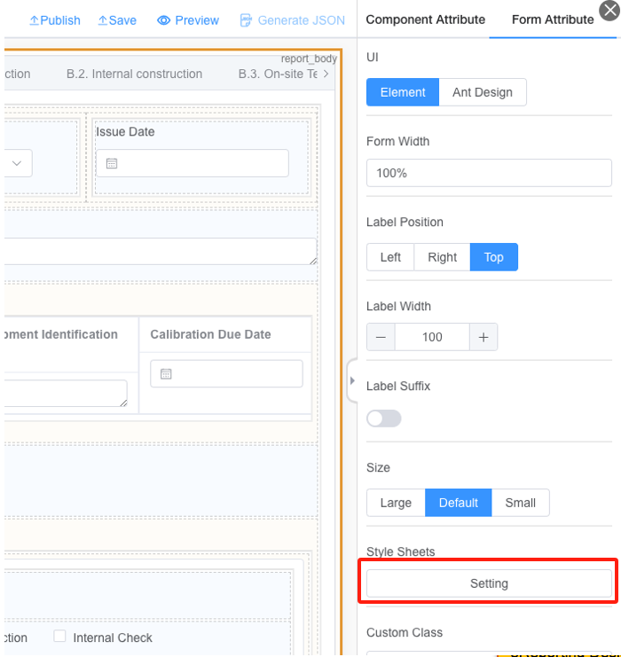

# Style Sheets

eReporting Designer support add CSS style sheet into the template.

## How to define Style Sheets ?

1.Click “Setting” button in “Form Attribute”.



:::warning
If want to control the background only within component, you can set the CSS as followings:

In some rare case, word canvas might not render css class successfully, please use lowercase for css definition to maximum the compatibility.
:::

```
.bg_customized 
{
    .el-input,
    .el-textarea,
    .el-radio-group,
    .el-input__inner,
    .el-textarea__inner,
    span {
        background: #55EFC4;
    }
}

```

2.You can directly type in the CSS style sheet here or simply copy from other existing CSS.


## How to use the Style Sheets ?

Click on the component in the Canvas, find the "Custom Class" property (which is a common property for all components) in the “Component Attribute” Panel, and you can find the CSS class list defined, bind the component with the style by simply select the style in the list (multiple selection is supported in case complex CSS class inherit needed)


