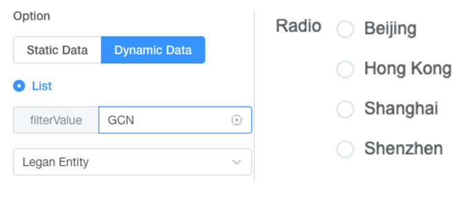
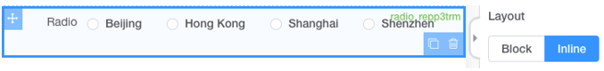

# Radio

## Features

- [X] Basic Usage
- [X] Data Source

### Basic Usage

Basic function :multiple selection,Search.

### Static Data Source

### Dynamic Data Source

### Binding Data Source from table colunm.

### Display Type

* Inline Type
  
* Block Type
  

## UI Preview

### Design Time

### Run Time

## Key Attribute for component

| Attribute Name | Attribute Description                                                                                                                                                                                                                                                                                                                                                                                                                                                                                | Additional Info                                                                                                                                                                                  |
| :------------- | :--------------------------------------------------------------------------------------------------------------------------------------------------------------------------------------------------------------------------------------------------------------------------------------------------------------------------------------------------------------------------------------------------------------------------------------------------------------------------------------------------- | :----------------------------------------------------------------------------------------------------------------------------------------------------------------------------------------------- |
| Source Key     | Component ID for the data source                                                                                                                                                                                                                                                                                                                                                                                                                                                                     | Select component can only support binding to component within a repeating table,the source key format would be***tableID.componentID***, source key has higher priority than data option |
| Layout         | Control whether to display the check box option Block or Inline                                                                                                                                                                                                                                                                                                                                                                                                                                      |                                                                                                                                                                                                  |
| Option         | To control the data source of the drop-down list:``1.Static Data: Manually input the selection options``2.Dynamic Data: Specify the data source from data maintained in List Management for the selection `` **List Selection:** choose where the data comes from`` **Filter Value:** input filter value if want to reduce the data range, the input filter value should meet the “filter value” maintained in List Management,leave it blank if you want to load all the data from the list |                                                                                                                                                                                                  |
