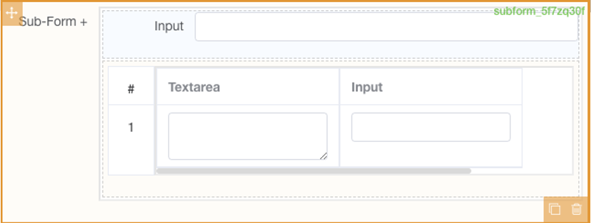

# Sub form+

## Features

- [X] Basic Usage
- [X] Line number
- [X] Data Souce

### Basic Usage

Basic function : add list fields, support paging and customize style.

### Line number

Config if need to display the line number and action icon for each line.

### Data Souce

Can set the default value for the sub-form list when the report form is initially loaded.

:::info

1.This need to input the default data as JSON format.
2.The input JSON should strictly follow the field definition

:::

## UI Preview

### Design Time

### Run Time

## Key Attribute for component

| Attribute Name | Attribute Description                                                                                                                                   | Additional Info                                        |
| :------------- | :------------------------------------------------------------------------------------------------------------------------------------------------------ | :----------------------------------------------------- |
| Source Key     | Component ID for the data source                                                                                                                        | N/A for this component                                 |
| Paging         | Set if support add paging to the repeating table                                                                                                        |                                                        |
| Page Size      | Set the page size for the list                                                                                                                          | This attribute only appears when the paging is enabled |
| Show Control   | Config if need to display the line number and action icon for each line                                                                                 |                                                        |
| Default Value  | Can set the default value for the sub-form+ list when the report form is initially loaded.``This need to input the default data as JSON format.n |                                                        |
| Prefix         | Prefix to the index, before number                                                                                                                      |                                                        |
| Suffix         | Suffix to the index, after number                                                                                                                       |                                                        |
| Index Width    | Control the index width to be shown on the page``in case the prefix/suffix make the index don't have enough space to show the combined index     |                                                        |
