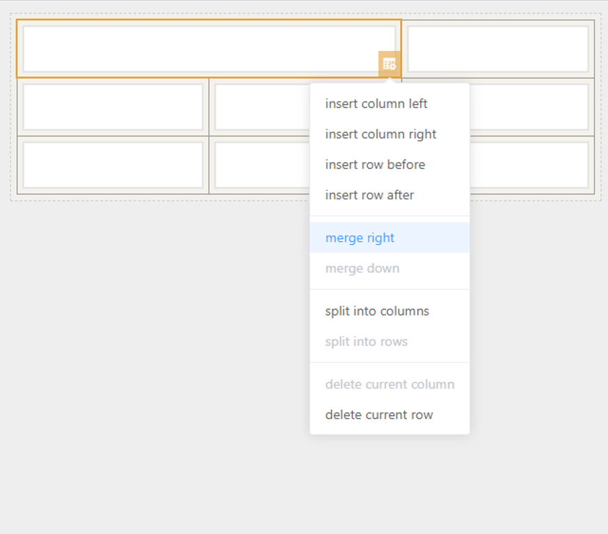

# Table

## Features

- [X] Basic Usage
- [X] Cell Setting

### Basic Usage

Basic function : add row, column, copy or delete.

### Cell Setting

Select cell  to insert, merge, split, or delete row.

## UI Preview

### Design Time

### Run Time

## Key Attribute for component

| Attribute Name                    | Attribute Description                                                           | Additional Info        |
| :-------------------------------- | :------------------------------------------------------------------------------ | :--------------------- |
| Source Key                        | Component ID for the data source                                                | N/A for this component |
| Border Width                      | Set the border width(px) for the table                                          |                        |
| Border Color                      | Set the border color for the table                                              |                        |
