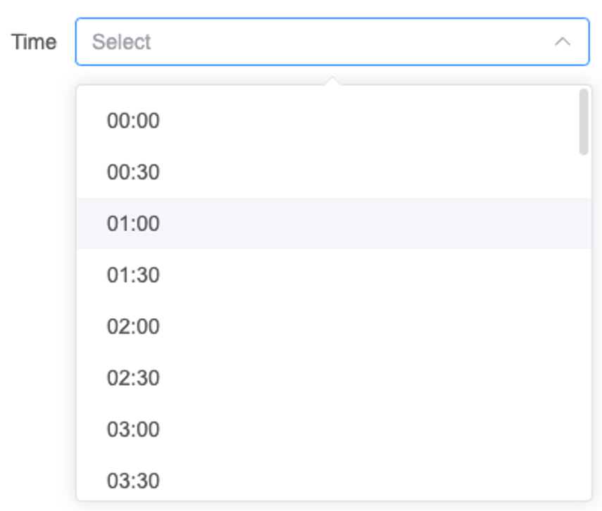

# Time

## Features

- [X] Basic Usage
- [X] Time Steps
- [X] Max/Min Value

### Basic Usage

Basic function : add or delete date field.

### Time Steps

Set the duration of the interval between each time selection item of the drop-down list.

### Max/Min Value

## UI Preview

### Design Time

### Run Time

## Key Attribute for component

| Attribute Name                    | Attribute Description                                                                                | Additional Info                                           |
| :-------------------------------- | :--------------------------------------------------------------------------------------------------- | :-------------------------------------------------------- |
| Source Key                        | Component ID for the data source                                                                     | Config when the input value is comes from other component |
| Time Steps（min）                 | Set the duration of the interval between each time selection item of the drop-down list              |                                                           |
| Help Text                         | Help text for the content                                                                            |                                                           |
| Max Value                         | Set the max value for the time range,` ` leave it blank if you don’t need to control the range |                                                           |
| Min Value                         | Set the min value for the time range,` ` leave it blank if you don’t need to control the range |                                                           |
