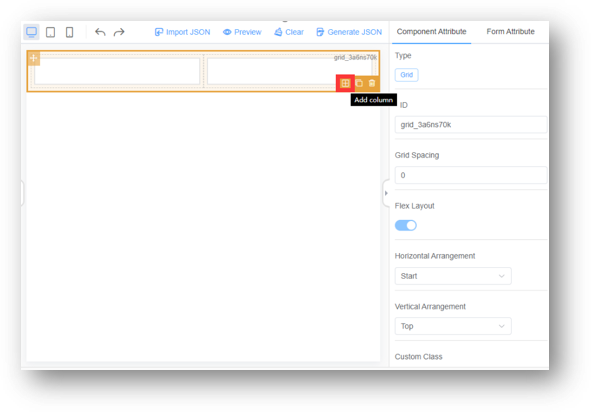
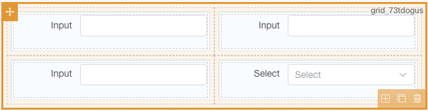
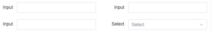

# Grid

## Features

- [X] Multiple columns
- [X] Nested Grid
- [X] Center Grid

### Multiple column Layout

Click Add Column to add the number of raster columns.

By selecting a separate column, you can configure properties such as the raster value of the column.

### Nested Grid

### Center layout

## UI Preview

### Design Time

### Run Time

## Key Attribute for component

| Attribute Name                    | Attribute Description                                                           | Additional Info        |
| :-------------------------------- | :------------------------------------------------------------------------------ | :--------------------- |
| Source Key                        | Component ID for the data source                                                | N/A for this component |
| **Grid Level Attributes**   |                                                                                 |                        |
| Grid Spacing                      | Control the padding space width(px) between grids                               |                        |
| Horizontal Arrangement            | Control the horizontal alignment behavior                                       |                        |
| Vertical Arrangement              | Control the vertical alignment behavior                                         |                        |
| **Column Level Attributes** |                                                                                 |                        |
| Grid Spans                        | Control the width for the current column (whole grid is 24 spans)               |                        |
| Offset                            | Control the offset width for the current column (whole grid is 24 spans)        |                        |
| Push                              | Control the Push relevant width for the current column (whole grid is 24 spans) |                        |
| Pull                              | Control the Pull relevant width for the current column (whole grid is 24 spans) |                        |
